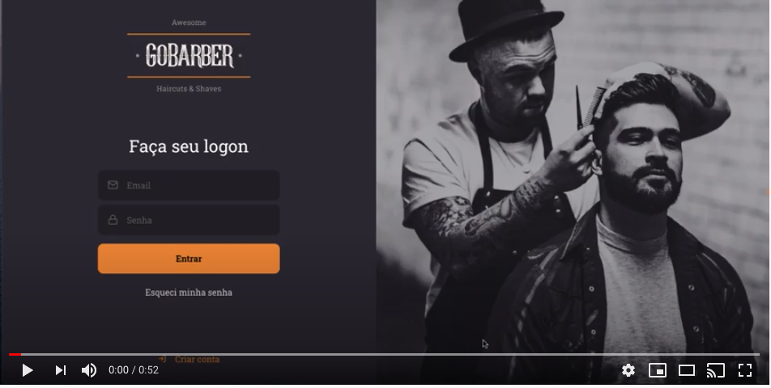

# GoBarber 

This is the web version for barbers make your registration and schedule administration.

## Goal 

Project created to study ReactJS.

_ReactJS and typescript used_

Using concepts of hooks, props, animations with the react-spring library and styled-components.

## Backend

Made with Node.js. Using postgres, mongodb and redis with the docker.

## Preview

**_Login_**

**_Create account_**

**_Schedule_**

**_Edit account_**

**_Schedule with appointment_**

**_Video_**

In this video you can see the animations, styles and authentications.

made by :two_hearts: _Pri Pinheiro_